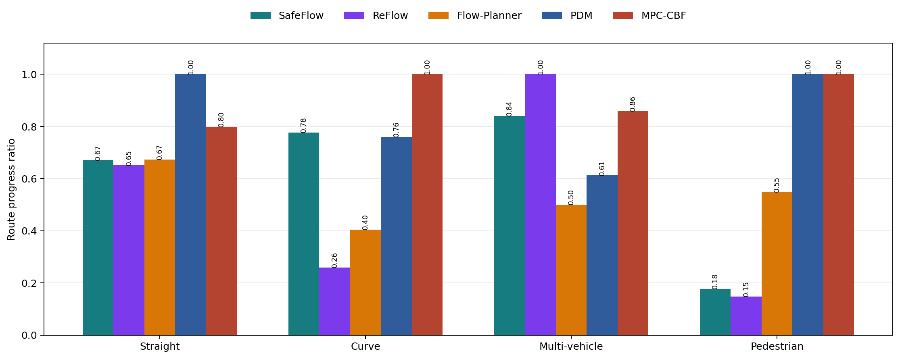
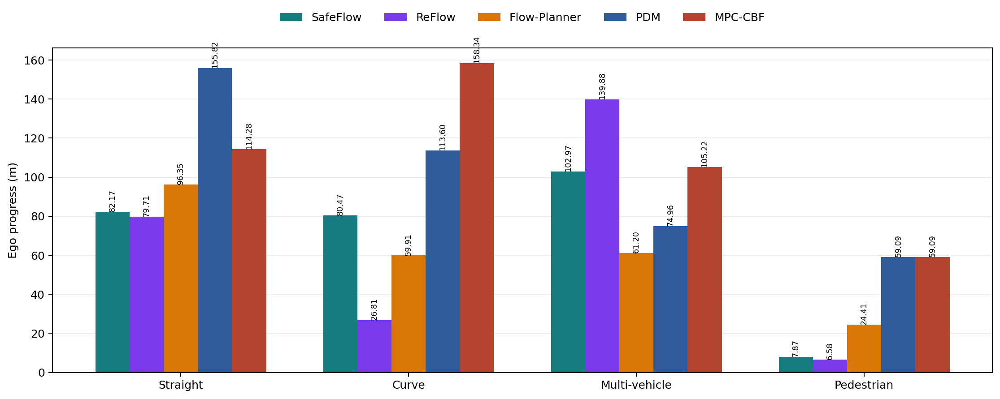
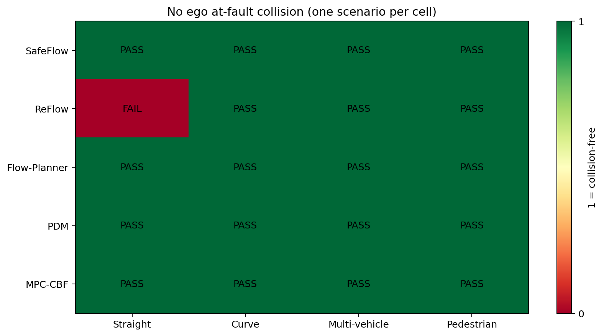
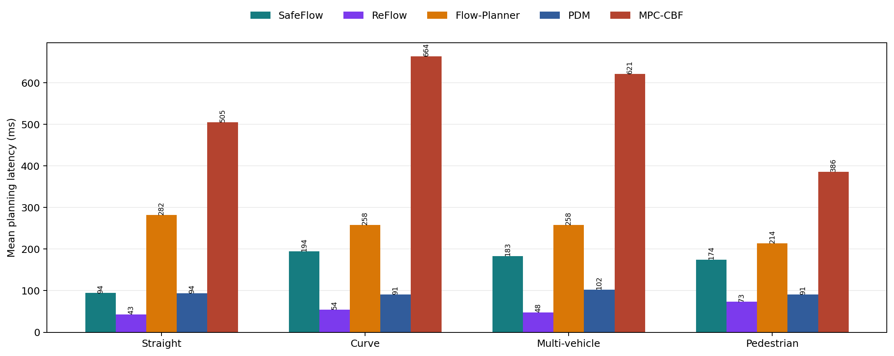
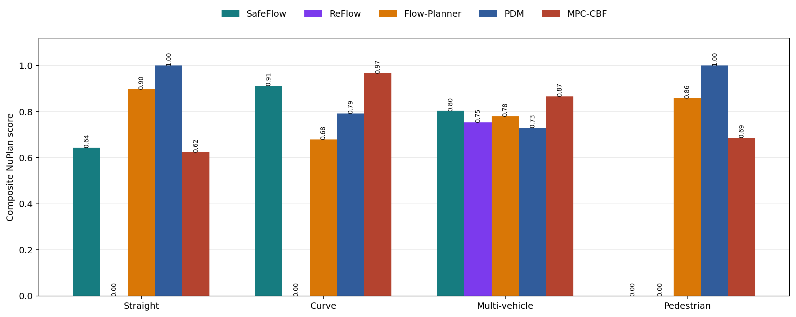

# SafeFlow、Flow-Planner 与 PDM 消融实验分析

生成日期：2026-08-27  
实验设置：每个规划器在相同的四类本地场景中运行 1 个 scenario，使用 CPU，闭环非反应式交通。

## 1. 主要结论

1. **PDM 的路线完成度和规划延迟最好。** 四个场景的平均 route progress ratio 为 0.843，平均单步规划延迟约 94.3 ms。
2. **SafeFlow 在多车场景中推进能力最好。** SafeFlow 多车 route ratio 为 0.841，高于 PDM 的 0.612 和 Flow-Planner 的 0.500。
3. **SafeFlow 行人场景是安全停车，不是完整通过。** 它没有碰撞，但只前进了 7.87 m，`ego_is_making_progress=False`，因此不能把这个结果描述为“避障成功通过”。
4. **原生 Flow-Planner 没有稳定的主动超车目标。** 当前纯 checkpoint 结果无碰撞，但更接近跟车或保持路线。之前的 `straight_overtake.nuboard` 使用了额外的 overtake wrapper，必须单独标注，不能作为纯 Flow-Planner 消融结果。
5. **当前的 100% 只表示单场景通过率。** 每个 cell 只有 1 个 scenario，所以 `1/1 = 100% collision-free`，不等同于统计意义上的避障概率。

## 2. 核心结果



图 1：`ego_expert_progress_along_route_ratio`。它衡量自车实际沿专家路线推进了多少，而不是单纯仿真是否结束。



图 2：自车沿专家路线的实际推进距离。不同场景的专家路线长度不同，因此应优先比较同一场景内的规划器，而不要直接比较不同场景的米数。

| 场景 | SafeFlow | Flow-Planner | PDM |
|---|---:|---:|---:|
| 直道 | 0.671 / 82.17 m | 0.673 / 96.35 m | **1.000 / 155.82 m** |
| 弯道 2 车 | **0.777 / 80.47 m** | 0.404 / 59.91 m | 0.760 / 113.60 m |
| 多车 | **0.841 / 102.97 m** | 0.500 / 61.20 m | 0.612 / 74.96 m |
| 行人 | 0.177 / 7.87 m | 0.548 / 24.41 m | **1.000 / 59.09 m** |

### 安全与行为指标



图 3：NuPlan 的 `no_ego_at_fault_collisions`。当前保存的 12 个结果均为无自车责任碰撞，但由于每个场景只有一次运行，该图不能支持“真实避障概率为 100%”的结论。

所有当前结果的共同点：

- `drivable_area_compliance = 1.0`；
- `driving_direction_compliance = 1.0`；
- 自车责任车辆碰撞数为 0；
- 自车责任 VRU 碰撞数为 0；
- `time_to_collision_within_bound = 1.0`，这是通过/未通过指标，不是实际的最小 TTC 秒数。

舒适性并不与安全性完全一致：

- SafeFlow：直道和多车为不舒适，弯道和行人为舒适；
- Flow-Planner：弯道为不舒适，其余三组为舒适；
- PDM：弯道和多车为不舒适，直道和行人为舒适。

这说明规划器可能通过更急的横向或纵向修正换取路线推进和避障空间。安全、完成度和舒适性需要同时报告。

## 3. 规划延迟与“时间最短”



图 4：`compute_trajectory_runtimes_mean`，单位为毫秒。

| 场景 | SafeFlow | Flow-Planner | PDM |
|---|---:|---:|---:|
| 直道 | 94.3 ms | 282.5 ms | **93.6 ms** |
| 弯道 | 194.3 ms | 258.2 ms | **90.8 ms** |
| 多车 | 183.0 ms | 258.0 ms | **102.1 ms** |
| 行人 | 174.4 ms | 213.6 ms | **90.5 ms** |

四组场景的仿真时间是固定 horizon：直道、弯道、多车约 14.8 s，行人约 11.8 s。因此 `runner_report.duration` 是机器运行时间，不能作为自车完成任务的时间。当前可复核的结论是：

> 如果“时间”指单步规划推理时间，PDM 最快，SafeFlow 次之，Flow-Planner 最慢；如果“时间”指首次避障或首次超车时间，当前标准指标还没有记录，需要额外事件检测。



图 5：NuPlan 聚合 score。该 score 是多个评价项的组合，不应替代碰撞率、路线完成度和延迟分别报告。

## 4. 如何解释三种方法

### SafeFlow

SafeFlow 的优势体现在显式安全约束和多车场景中的路线推进。多车实验达到 102.97 m，且无自车责任碰撞。行人实验则表现为保守等待：它牺牲了路线完成度，换取了不与行人发生冲突。

直道第二次运行使用了 `SINGLE_AGENT_VEHICLE_POSITION_SCALE=0.80`。第一次默认位置压缩为 0.35 时发生了车辆碰撞，因此第一次结果没有纳入本报告。弯道运行中出现过一次 loopy path 异常，随后使用了 collision-checked safety fallback；最终闭环无碰撞，但这应作为实现行为记录在实验说明中。

### Flow-Planner

当前使用的是原生 Flow-Planner checkpoint。它在四个保存结果中均无自车责任碰撞，且都保持在可行驶区域内，但路线完成度低于 PDM，尤其是弯道和多车场景。原生 checkpoint 并不包含显式 overtake objective，因此减慢前车后可能跟车或减速，而不是自动完成超车。

`straight_overtake.nuboard` 使用了显式换道、碰撞检查和超车 wrapper，适合展示“带安全 wrapper 的超车”，但不应与原生 checkpoint 放在同一个公平消融列中。

### PDM

PDM 在当前四个场景中平均路线完成度最高，同时单步规划延迟最低。直道和行人场景达到 route ratio 1.0。弯道和多车场景虽然无碰撞，但舒适性为 False，说明其候选轨迹选择在复杂交通中可能产生较强控制动作。

## 5. Table 3 截图解读

Table 3 反映的是训练/模型组件消融，不是上述四个 NuBoard 场景的直接评价。完整配置的代表性结果为：

```text
CLS-NR          94.07
S-CR            99.22
S-Area          99.22
S-PR            95.06
S-Comfort       91.09
Loss Selector    1.03
Loss Generator 1624.5
```

主要含义：

- Reward Quality 打开后，CLS-NR 从约 31.79 提升到 90 以上，说明奖励质量对闭环行为影响很大；
- Coordinate Transform 和 KNN 主要改善闭环规划指标，表明局部坐标对齐和邻居建模对避障有效；
- 完整配置不是每一个单项的最大值，而是路线、避障和舒适性之间更均衡的配置；
- S-Comfort 没有和所有规划指标同步上升，说明更积极的避障可能带来舒适性代价；
- open-loop loss 下降不代表闭环必然更好，因为闭环还受历史误差、状态分布偏移和执行器响应影响。

## 6. Table 4 截图解读

Table 4 对比 IL/RL loss，以及 Mode Dropout、Selector Side Task、Ego-history Dropout 和 Backbone Sharing。截图中 IL 完整配置和较好 RL 配置可以概括为：

| 指标 | IL | RL | RL - IL |
|---|---:|---:|---:|
| CLS-NR | 93.41 | 94.07 | +0.66 |
| S-CR | 98.85 | 99.22 | +0.37 |
| S-Area | 98.85 | 99.22 | +0.37 |
| S-PR | 93.87 | 95.06 | +1.19 |
| S-Comfort | **96.15** | 91.09 | -5.06 |

因此 Table 4 的合理结论是：

- RL 更偏向提升闭环规划、避障和场景适应能力；
- IL 的舒适性更高，但 RL 可能通过更积极的动作获得更好的规划指标；
- Backbone Sharing 和 Selector Side Task 可能提升规划指标，但 generator loss 不一定更低；
- Table 4 中出现的 generator loss 5424.3、1928.1 不能单独用来判断闭环质量；
- IL/RL 的 loss 和 NuPlan 的 collision-free、route ratio、comfort 属于不同层次指标，不能直接混成一个排序。

## 7. 当前结果的统计限制与下一步

当前每个实验只有 1 个 scenario，建议正式实验至少使用多个日志和随机种子。需要新增的行为级指标包括：

1. 首次检测到障碍物的时间；
2. 首次离开原车道的时间；
3. 最小几何安全距离；
4. 首次超过障碍车辆的时间；
5. 超车完成率，即自车纵向超过障碍车并保持目标车道安全间距；
6. 行人通过期间的等待时间和是否在行人通过后恢复行驶；
7. 每个场景的 collision-free rate、route completion、comfort 和 inference latency。

建议最终论文使用如下表述：

> 在当前单场景测试中，三种规划器均实现了无自车责任碰撞，但该结果仅代表 1/1 场景通过，不能解释为具有统计意义的避障概率。PDM 具有更高的路线完成度和更低的规划延迟；SafeFlow 在多车场景中表现出较好的安全约束和路线推进能力，但在行人场景中采取了保守等待策略；原生 Flow-Planner 能保持无碰撞和可行驶区域约束，但缺少稳定的主动超车行为。

## 8. 数据与复现

- 原始汇总数据：[metrics.csv](metrics.csv)
- 图表生成脚本：[generate_report.py](generate_report.py)
- SafeFlow 直道 NuBoard：[../saved_nuboards/safeflow_straight.nuboard](../saved_nuboards/safeflow_straight.nuboard)
- SafeFlow 弯道 NuBoard：[../saved_nuboards/safeflow_curve.nuboard](../saved_nuboards/safeflow_curve.nuboard)

重新生成图表：

```bash
/new_world/cockatiel/miniconda3/envs/nuplan_clean/bin/python \
  ablation_analysis/generate_report.py
```
